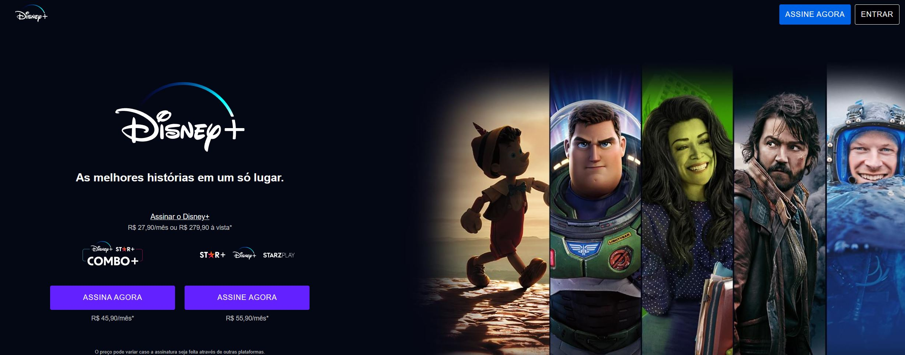

Disney+ Clone

Projeto de clone da página do Disney+.
Foi utilizado o HTML, CSS e Javascript para recriar a página inicial da plataforma de stream Disney+.

## Skills utilizadas:

 
  
  
   
  

  